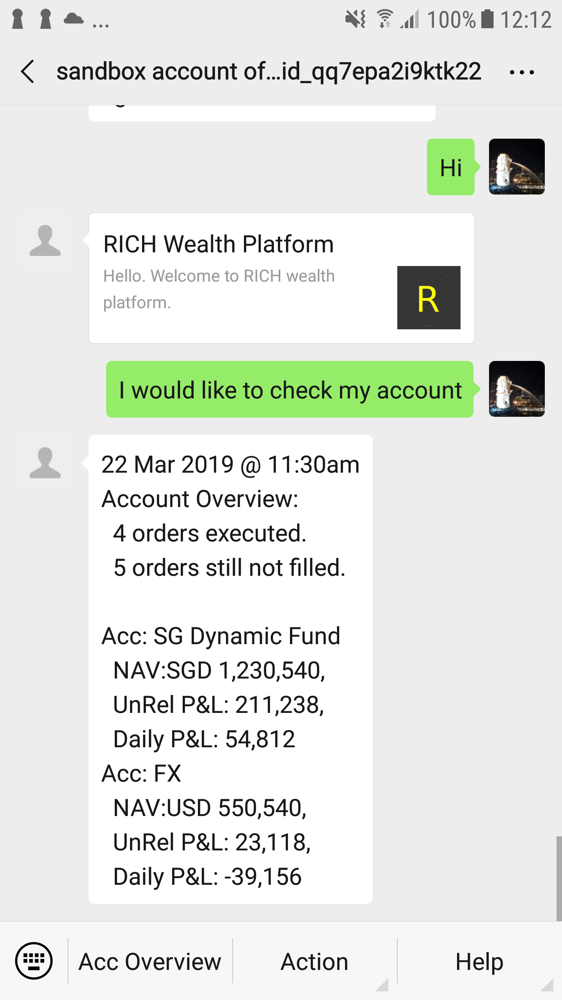
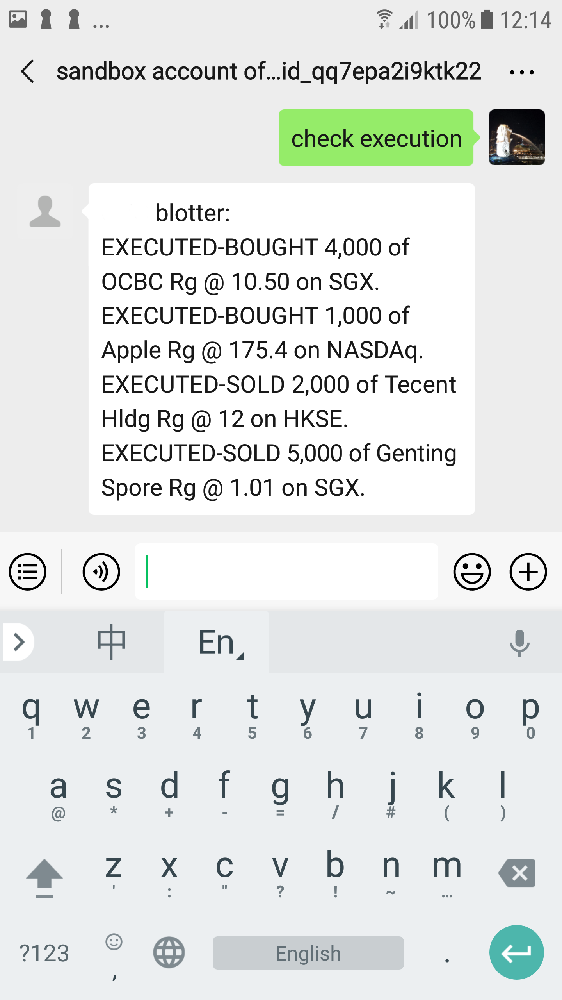
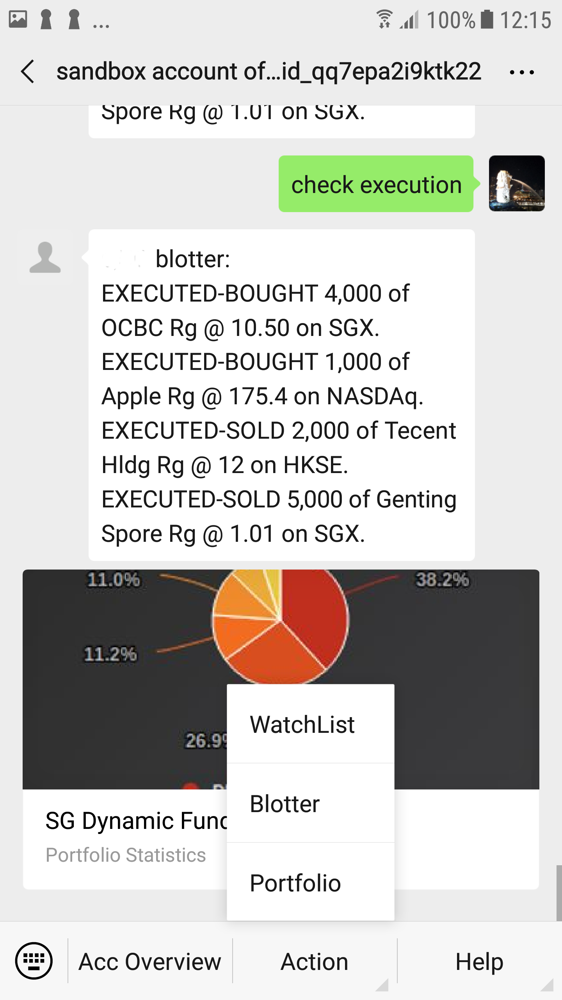
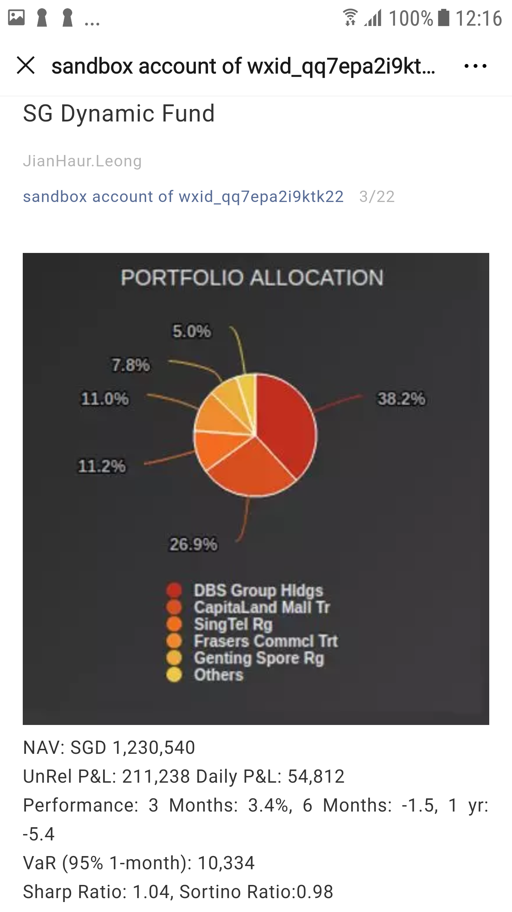

[![Apache License 2.0][license-shield]][license-url]
[![LinkedIn][linkedin-shield]][linkedin-url]

# WeChat bot for Wealth platform 

Demo of a WeChat bot for wealth managmeent platform. It use the google [Dialogflow](https://dialogflow.com/) as the natural language processing (NLP) engine.

## Setup

Create an account at the [WeChat sand box](https://mp.weixin.qq.com/debug/cgi-bin/sandbox?t=sandbox/login). The parameters appID, appsecret and Token provided in this page is going into the .env configuration file.

## Screenshots

### Overview
Overview of your account. It used the Dialogflow intents and response to capture the instruction from user.

  

### Blotter
Your trade execution blotter. The bot will send you alert messege when there is update in the blotter.

  

### Action Buttons
The bot functionalities can be accessed from the action buttons at the bottom of the screen.

  

### Portfolio Details
Portfolio details in asset allocation with a pie chart. It calculate the portfolio return and various risk parameters.

  

## License
[Apache License 2.0](https://github.com/jhleong/Wealth-Wechat-bot/blob/master/LICENSE)

<!-- MARKDOWN LINKS & IMAGES -->
<!-- https://www.markdownguide.org/basic-syntax/#reference-style-links -->
[license-shield]: https://img.shields.io/github/license/jhleong/Wealth-Wechat-bot
[license-url]: https://github.com/jhleong/Wealth-Wechat-bot/blob/master/LICENSE
[linkedin-shield]: https://img.shields.io/badge/-LinkedIn-black.svg?style=flat-square&logo=linkedin
[linkedin-url]: https://www.linkedin.com/in/jhleong/
